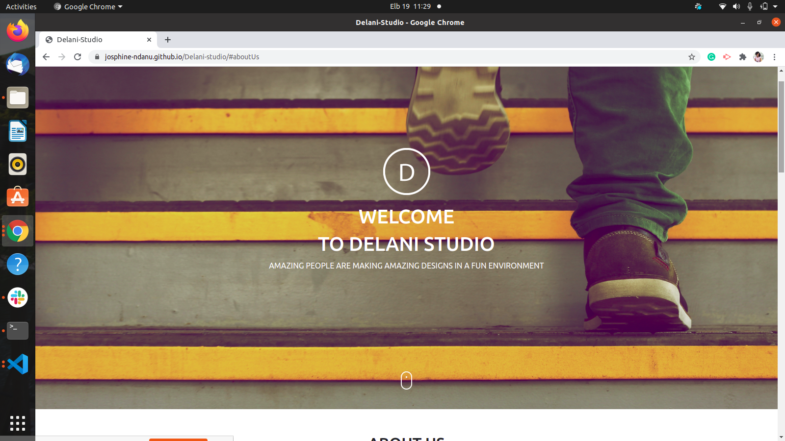

#DELANI STUDIO

## Author
Josphine Ndanu, josphinendanu3@gmail.com

## Description
This project helps identify the day you were born then also ouputs your Ghananian Akan name based on the input you give.

### Prerequisites
You should have git installed.
Use the following command for installation.
`$ sudo apt install git-all`

### Setup
To access this project on your local files, you can clone it using these steps

Open your terminal
lone using this command `$ git clone https://github.com/josphine-Ndanu/Delani-studio
This will clone the repository into your local folder
### Technologies Used
 HTML
 CSS
 js
 jQuery
 bootsrap 5
 Git

### Live Site
View [live](https://josphine-ndanu.github.io/Delani-studio/)

### Licence
This project is under the  [MIT](LICENSE) licence

